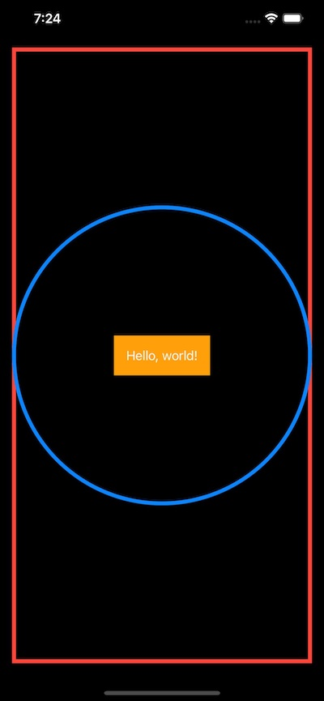
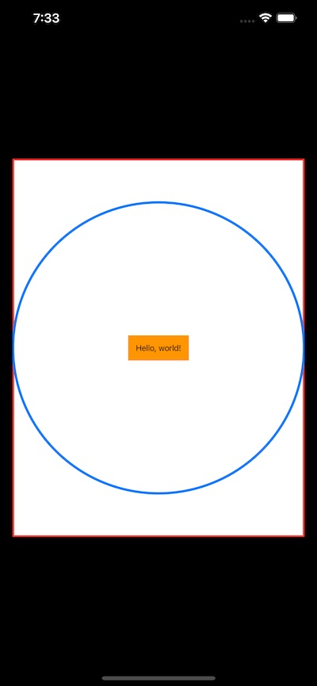
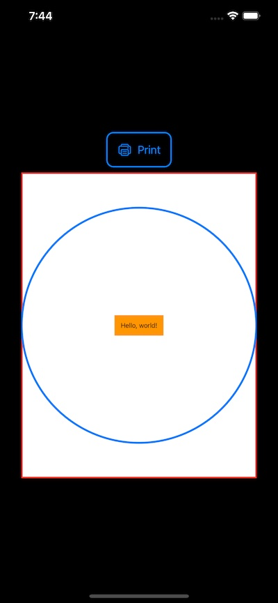
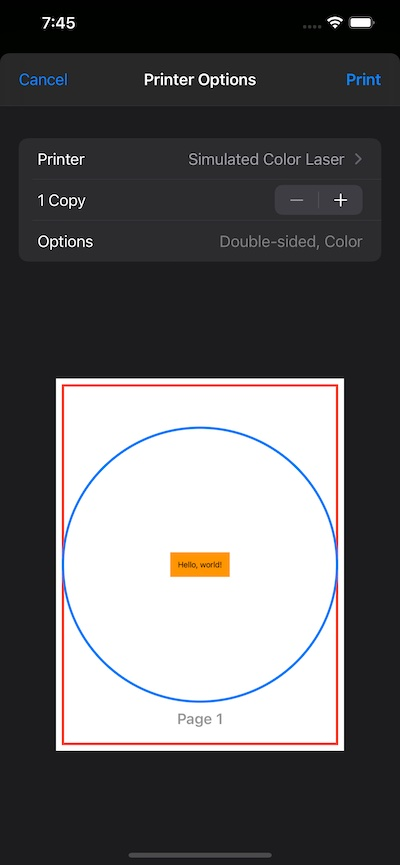

# SwiftUIPrint

## Affordances for printing views laid out using SwiftUI.

### by Wolf McNally

The full code for the demo of this package is in [SwiftUIPrintDemo](https://github.com/wolfmcnally/SwiftUIPrintDemo).

Let's say you have a SwiftUI `View`. It's adaptive to its container size and displays correctly under dark mode or light mode:

```swift
struct MyPageView: View {
    var body: some View {
            ZStack {
                Circle()
                    .inset(by: 2.5)
                    .stroke(Color.blue, lineWidth: 5)
                Text("Hello, world!")
                    .padding()
                    .background(Color.orange)
            }
            .background(
                Color.clear
                    .border(Color.red, width: 5)
            )
        }
    }
}
```

In the Simulator our view looks like this:



Now, let's say you want a button that *prints* this view to any printer. Ahh, not so fast! There's currently no simple way out of the box for SwiftUI to do that. **SwiftUIPrint** makes it easy to print a SwiftUI view using scalable resolution.

**SwiftUIPrint** provides a `PagePreview` so you can display your view as a thumbnail in roughly the aspect it will be printed. Here's the code for that:

```swift
struct ContentView: View {
    var body: some View {
        PagePreview(page: MyPageView(), pageSize: .constant(CGSize(width: 8.5 * 72, height: 11 * 72)))
            .padding()
    }
}
```

And here's how it looks in the simulator:



Notice that not only is the background white, but the text is also black and *not* white as in the first figure above. `PagePreview` shows your view in light mode, as it will be printed.

From here it's just a small step to setting up a view that shows the preview of the view you give it, lets you adjust any settings you require, and launches the actual printing workflow:

```swift
struct PrintSetup<Page>: View where Page: View {
    let page: Page

    var body: some View {
        VStack {
            Button {
                presentPrintInteractionController(page: page)
            } label: {
                Label("Print", systemImage: "printer")
                    .padding()
                    .overlay(
                        RoundedRectangle(cornerRadius: 10.0)
                            .stroke(lineWidth: 2.0)
                    )
            }
            PagePreview(page: page, pageSize: .constant(CGSize(width: 8.5 * 72, height: 11 * 72)))
        }
        .padding()
    }
}
```

The call to `presentPrintInteractionController()` does the magic of invoking the `UIPrintInteractionController` with all the information it needs to render your SwiftUI view!

```swift
struct ContentView: View {
    var body: some View {
        PrintSetup(page: MyPageView())
            .padding()
    }
}
```

Here's how that looks in the app:



And when the Print button is tapped:



The resulting output will be at retina resolution, which looks great on most printers.

**⚠️ Note:** This technique depends on having SwiftUI render itself into a CoreGraphics context. This does *not* give you as much flexibility as rendering to a CGContext yourself. For instance, if instead of going straight to a printer you export to PDF instead, then any Text views you render using this method will still end up being bitmapped graphic objects in any PDF you export, and not actual text.

🐺